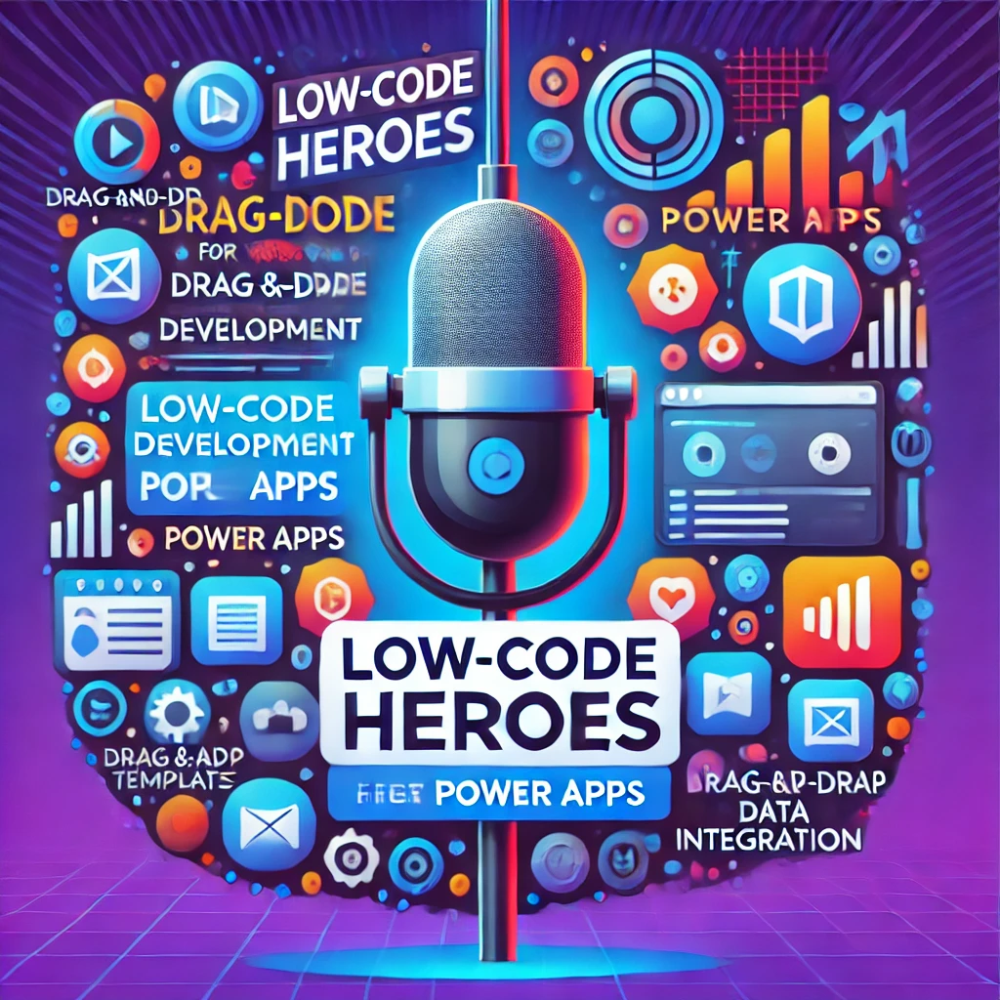

    preview do podcast

    <audio src="output/podcast_editado.MP3" controls title="Podcast editado"></audio>

# Projeto Podcast Gerado por I.A.s

Projeto com o objetivo de gerar um podcast utilizando ferramentas de IA através de prompts mais trabalhado.

Utilizer uma esteira de prompts para gerar cada etapa do processo criativo.

## 💻 Tecnologias utilizadas no projeto

- [ChatGPT](https://chat.openai.com/) 
- [dall-edfree](https://www.dall-efree.com/user/image-generator)
- [ElevenLabs](https://beta.elevenlabs.io/)
- [Capcut](https://www.capcut.com/pt-br/)

## ✨ Como foi feito ?

- Roteiro gerado via chatgpt conforme prompts utilizados.pdf disponivel neste repositorio
- Audio gerado pela elevenLabs
- dall-edfree Para gerar capas
- Capcut para tratar aúdio e adicionar sons de fundo

OBS: Não foi possivel o uso do Midjourney para gerar imagem, pois estava indispoivel a vesão gratuita.

## 🛠️ Instruções de execução

- 🤖 1. Use os prompts de roteiro no `chagpt`
- 🤖 2. Use os prompts de roteiro gerados pelo chatgpt no  `ElevenLabs`
- 🤖 3. Use os prompts de artes no `midjourney`

